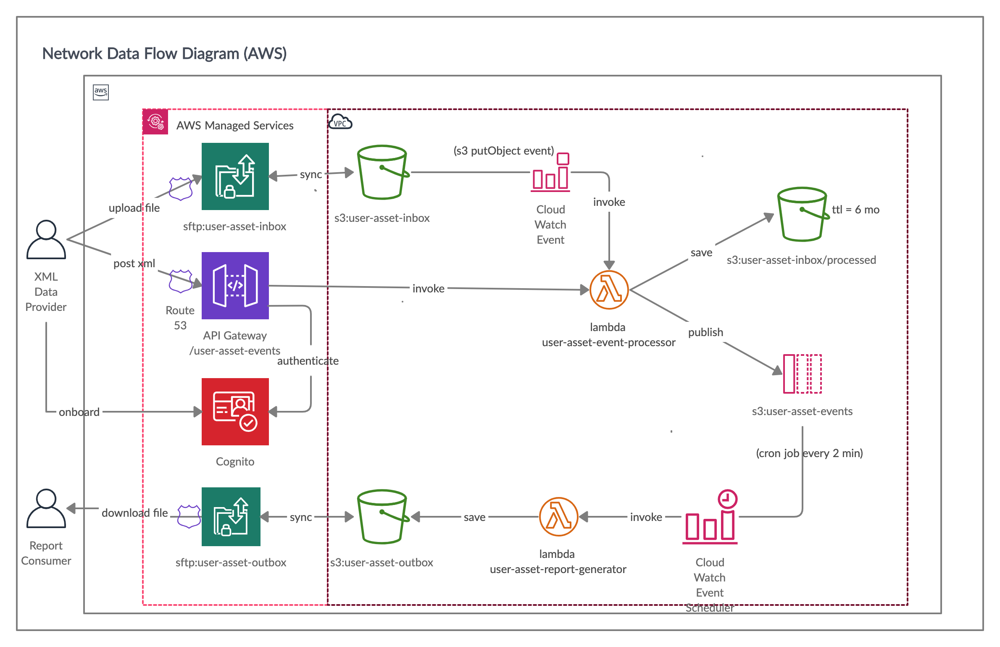

# user-asset-translator

## Purpose

The purpose of this application is to process input from a Client that provides data in XML (either via SFTP or HTTP) and translate it into report format for another client to consume over SFTP.


## Implementation Summary

This implementation uses AWS Serverless technologies. Essentially, an xml message is received either:

  (1) on an AWS Integration Family managed SFTP Service that is backed by a s3 bucked called `user-asset-inbox`, 
  or (2) a post message sent to API Gateway. 
  
The XML messages are sent to an AWS Lambda called `user-asset-event-processor` either by a cloud watch event listener that listens for S3 PutObject events, or is invoked as an endpoint handler in AWS Gateway. 

The  `user-asset-event-processor`'s duty is to immediatly split into single messages and map to json format matching our internal object serialized format and put onto sqs queue to be held for batch processsing. 

A CloudWatchEvent Scheduled Cron job is configurued to invoke a lambda to consume all messages on queue, convert them to report format, put the original file onto the s3 buckets' processed folder (in case we need to replay them), and then eventually generate the report with account entriess, and account total summary information and is sent to the s3 `user-asset-outbox` bucket, which will immediatly make it available on the SFT managed service for clients to consume.

## Reasoning

Rather than creating application servers, reverss-proxies, logging services, database stored authentication users, I decided to leverage Cloud managed services for many processes like SFTP file transfer & storage (AWS SFTP Managed Service), authentication and user management and user data storage (AWS API Gateway + Congnito User Pool). 

The Clound Durable Messages Queues lets us collect messages and hold them until the batching interval is ready to generate new report of batches. 

I also wanted to make the service is auto-scalable as possible. By taking adavantge of lambda/cloud functions concurrency, and boost capibilities. 
There are two lambda/cloud functions's total in this implementation, one to collect messages, normalize them into single record json payloads and publish them to queue, and another to consume messages from queue and generate a report file to then upload the report onto s3 or sftp server. 

Cloud events and schedules are helpful because the have built in loggin features. At any point any of the entry point technologies can be replaced and easily integrated with the existing lambdas and queue flow.

## Network Diagram(s)
 
 **AWS**
 

 **GCP**
 

## Components and Actors

 - **XML Data Provider**:
   This is a user or client system that posts xml payloads to our http endpoint or sftp folder. 
<br/>
 - **Report Consumer**:
   This is a user or client system that downloads files from our sftp server
<br/>
 - **SFTP Service**
    Only one server is needed. Clients can have separate inbox and outbox folders that only they have access to. Amazon has a managed service as part of their [aws-transfer-family](https://aws.amazon.com/aws-transfer-family) services. You can setup an sftp inbox to point to a specific s3 buckets and sub folders. See: S3 Bucket/Cloud Filestore for more information. GCP does not have a managed sftp service, so we can just setup a simple linux sftp service using a community docker image and setup file listeners to immediatly move the files to a file store. We

    note: we will need to setup Route 53 or DNS CNAME to give our clients a pretty url to use. 

    > **Security and Authentication:** 
    > *The AWS solution* can be done with an RSA PrivateKey (no need for username and password) 
    > *The GCP solution* would require ssh-ing into the linux service and adding usernames and passwords for our client(s). We can this into a firebase user pool if need be.
    > *IP Whitelisting** should be done for both solution as an additional layer of security
    >*Firewall* configuration should to only allow ssh and ftp ports to be accessible 
<br/>
 - **AWS Gateway/Cloud Endpoint**
    A Cloud Managed API Gateway the can be re-directed to any solution in the future. 
    One of the advantages of using a gateway is we can use a managed service for user management
<br/> 
  - **Cognito/Firebase**  
    We can use `Cognito` or `Firebase` to onboard users into user pools, manages permissions, rotate and store credentials, as well as facilitate client self-serving password update.

    > **Authentication:** 
    > The AWS solution can be done with a cognito apiKey, that only the client is privy to
    > The GCP solution can be done using Firebase credentials
<br/> 
  -  **S3 Bucket/Cloud Filestore**  
    Before setting up the SFTP services will need create a file storage bucket. In our case we would setup `user-asset-inbox`, `user-asset-inbox/processed`, `user-asset-inbox/errors`, and `user-asset-outbox`.  For multi-tenancy it would be a good idea to setup the folders with client username prefixes like this: `{client-name}/user-asset-inbox`. We can also set a time-to-live policy for these files. My suggestion is to only hold the files for 6 months (to reduce storage cost later on)
<br/>
  -  **Lambdas/Cloud Functions** 
    Lambdas and Cloud Functions are serverless compute process with minimal scope. 
    Modern age tooling like AWS SAM makes it easy for us to specify a CloudFormation template to create and manage the necessary AWS Resources, Policies, Permissions and CloudWatch Events that are required to immediatly use the compute process. 
    By default there is a 14 min timeout, but we can configure based on our usecase, Logging features come in the box, and we can test the services locally. My suggestion is to write these in nodejs or python (I prefer node), rather than Java, because of cold start issues.<br/>
    *We will need 2 lambdas/cloud functions:* 
        1) `user-asset-event-processor`: Tasked with ...
        - receiving xml file content or payload and splitting the batches into single entries 
        - normalizing the data json format that represents our internal format
        - validating against the normalized form
        - assign identifiers (for logging and tracibiliy)
        - If the input was from s3, the original file is moved from `user-asset-inbox` to `user-asset-inbox/processed`, and if an error occured it is logged and sent to `user-asset-inbox/errors`.
        - putting the events onto Queue, for another lambda to process. 
        <br/>
        2) `user-asset-report-generator`: Tasked with ...
        - receiving all json entries on queue 
        - calculating SUM(UserAssetAccount.amount) for all entries
        - if an error occurs, we should log the error messages and store the failures so we can later replay them. We should also put a redrive policy on the queue that will put the messages on an retry queue, so we can setup alerts and write a script to run replay the event payload. (this is helpful if there is a bug anywhere along the chain of handoffs)
        - lastly, the lambda will put the events on S3 (or in the case of GCP directly on the SFTP endpoint to be consumed)
  <br/>
  -  **SQS/Cloud Pub Sub Queues and Topics** 
      Queues are great to use in this usecase because we can hold messages back and control the flow of user asset entries to either be consumed immediatly or on a scheduled cron job. We just need one queue for the `user-asset-events` (json) and another to store retry failures `user-asset-events-failures`.
<br/>
  -  **CloudWatch Events & Schedulers /GoogleCloud Triggers & Schedulers**
    Both AWS and Google Cloud have scheduling services and event listeners. 
    These are needed to initiate the transfer of User Asset Files and Events from point-to-point. 
    - Here are the transfer activities that need to be done:
       - **File Store to user-asset-event-processor:**
          - *AWS*: Cloud Watch Event (packaged with user-asset-event-processor SAM project) set to listen for S3 PutObject events and immediatly invoke the lambda
          - *GCP*: The Cloud Function can be created with a Cloud Storage Create trigger to invoke the function with the file
       - **Queue/Topic user-asset-report-generator:**
          - *AWS*: Cloud Watch Schedule (packaged with user-asset-event-processor SAM project) set to run on a cron schedule (every few min, every hour, daily, etc)
          - *GCP*: Google Cloud Scheduler can notify a topic to invoke the function to process the messages in a Pub/Sub queue or topic

## Sequence Diagram
 **SFTP**
 

  **HTTPS**
   

## Entities

Entity Diagram of Input. (I find it is best to always create a class structure that exactly matches the external systems' structure as well as a structure that 

**External System Model (UML)**
```                                
                                                                                       +-------------------------------+                                                     
                                        +---------------------------+             0..n |       AssetAccount            |                
+--------------------+             0..1 |   UserAssetProfie         |                  | ------------------------------|     
|       User         | 1                | ------------------------- |                  | PK accountNumber      (string)|              
| ------------------ |                  | PK assetProfileId (string)|-|--------------o<| FK assetProfileId     (string)|               
| PK userId  (string)|-|---------------o| FK userId         (string)|           +----|-| FK assetDescriptionId (string)|
|                    |                  |                           |           |      |     amount (decimal )         |  
+--------------------+                  |                           |           |     1|                               |         
                                        +---------------------------+           |      +-------------------------------+
                                                                                |      
                                                                                |
                                                                                |      +----------------------------------+ 
                                                                                | 0..1 |       AssetDescription           | 
                                                                                |      | -------------------------------- | 
                                                                                +----|<| PK assetDescriptionId    (string)| 
                                                                                       |    bankAccountType       (string)| * cardinality = CHECKING|SAVINGS
                                                                                       |    retirementAccountType (string)| * cardinality = 401k | IRA
                                                                                       |    bankName              (string)| 
                                                                                       |                                  | 
                                                                                       +----------------------------------+
```
**External System Class Structure**

```
class User {
	private String userId
	private AssetProfile asset
}

class UserAssets {
	AssetAccount[] bankAccount
	AssetAccount brokerageAccount
	AssetAccount retirementAccount
}

class AssetAccount {
	String accountNumber
	Double amount 
}

class AssetDescription {
	String accountNumber
	Double amount
}
```

**Internal Normalized Model (UML)**
```
                                                                                 +----------------------------------------+   
                                      +--------------------------------+    0..1 |      ASSET_ACCOUNT_ALLOCATIONS         |  
+-----------------------+        0..n |       ASSET_ACCOUNTS           |         | -------------------------------------- | 
|       USERS           | 1           | ------------------------------ |    +--|<| PK asset_account_id         VARCHAR(80)|  
| ----------------------|             | PK asset_account_id VARCHAR(80)|-|-/     |    type                     VARCHAR(20)|                                 
| PK user_id VARCHAR(80)|-|---------o<| FK user_id          VARCHAR(80)|         |    percent                  NUMBER(3,0)|                                
|    external_user_id   |             |    bank_name       VARCHAR(255)|         +----------------------------------------+
+-----------------------+             |    account_number   VARCHAR(80)|         
									  |    amount          NUMBER(10,2)|                                              
                                      |    account_type     VARCHAR(20)|         
                                      |    tax_code          VARCHAR(4)|         
                                      +--------------------------------+ 
```

**External System Class Structure**

```
class User {
	private String userId
    private String externalUserId
	private AssetAccount[] assetAccounts
}

class AssetAccount {
    String accountAccountId
	String accountNumber
	Double amount
    AccountTypeEnum accountType
    TaxCodeEnum taxCode
    AssetAccountAllocations[] allocations
}

class AssetAllocation {
	String assetAccountId
	AssetAllocationTypeEnum type
    int percent
}
```

**Internal Normalized Model Example Payload (Json Messages on Queue)**
```
{
    "userId": "<uuid>",
    "externalUserId": "3562662382393",
    "assetsAccounts": [
            {
                "assetAcountId": "<uuid>",
                "accountType": "BANK",
                "accountNumber": "123895769767",
                "amount": "27576",
                "taxCode": "CHECKING",
                "bankName": "CHASE"
            },
            {
                "assetAcountId": "<uuid>",
                "accountType": "BANK",
                "accountNumber": "123895769767",
                "amount": "12546",
                "taxCode": "SAVINGS",
                "bankName": "CITI"
            },
            {
                "assetAcountId": "<uuid>",
                "accountType": "BROKERAGE",
                "accountNumber": "5556876547",
                "amount": "335464",
                "taxCode": "BROKERAGE",
                "bankName": "CITI",
                "allocations": [
                    {type: "stocks": "percent" 50},
                    {type: "bonds": "percent" 20},
                    {type: "other": "percent" 30}
                ]
            },
            {
                "assetAcountId": "<uuid>",
                "accountType": "BROKERAGE",
                "accountNumber": "88876758798",
                "amount": "6615",
                "taxCode": "401K",
                "bankName": "CITI",
                "allocations": [
                    {type: "stock": "percent" 100}
                ]
            }
        ]
    }
}
```

## Report Generation Strategy
I would create a mustache template and for each messsage, on queue validate all the necessary parts are there, then apply the deserialized payload object to the mustache template, and accumulate a running total(s) and have add that to the bottom section of the report.  

## Deployment

AWS Code Deploy is a helpful service to create AWS SAM resources as handling the deployment of lambdas. 
I would recommend using Github webhooks to trigger post merge to master events and kickoff Jenkins jobs that will utilize CodeBuild and CodeDeploy plugins in order create deployments in AWS.

With GCP, we can accomplish the same thing by using jenkins and then Google Cloud SDK 

 **AWS**
 

 **GCP**

